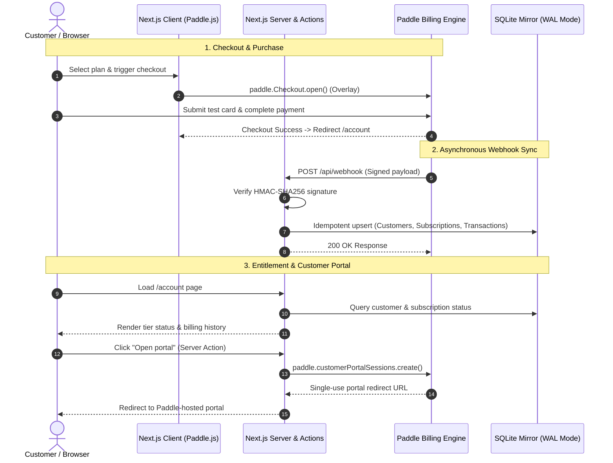
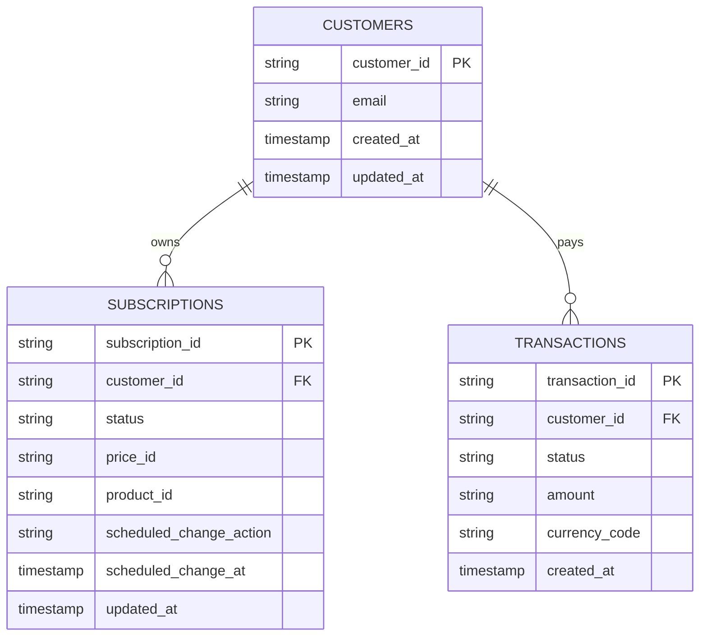

# 💳 Paddle Billing & Payment Gateway Demo

<p align="center">
  <strong>Production-ready SaaS billing integration built with Next.js 16 (App Router), Paddle Billing, Tailwind CSS v4, and SQLite.</strong>
</p>

<p align="center">
  
  
  
  
  
  
</p>

---

## 📖 Overview

This repository demonstrates an end-to-end, production-grade integration of **[Paddle Billing](https://www.paddle.com/)** (Paddle's Merchant of Record platform) within a modern **Next.js 16 (App Router)** SaaS application.

It solves real-world billing architecture challenges:
- **Zero Payment Headaches**: Paddle acts as Merchant of Record (handling global sales tax, VAT, compliance, and currency conversion).
- **Frictionless Checkout**: Paddle.js overlay modal with prefilled customer emails and 1-click test card helpers.
- **Dynamic Localized Pricing**: Real-time localized price preview based on visitor IP or country headers.
- **Secure Webhook Pipeline**: Raw-stream HMAC-SHA256 signature verification via `@paddle/paddle-node-sdk` with non-blocking idempotency.
- **Self-Service Customer Portal**: Direct session minting via Next.js Server Actions to allow users to manage payment methods and download tax invoices without exposing sensitive secrets.
- **Complete Subscription Lifecycle**: Plan upgrades/downgrades with proration, cancellation scheduling (`next_billing_period` vs `immediately`), and graceful handling of `past_due` dunning.

---

## 🏗️ Architecture & Data Flow



---

## ✨ Key Features

- ⚡ **Paddle.js Overlay Checkout**: Sleek, one-page overlay checkout with prefilled customer data, custom success callbacks, and sandbox test card copy utilities.
- 🌍 **Localized Price Previews**: Uses `paddle.PricePreview()` to automatically query localized pricing and tax rates per customer currency (USD, GBP, EUR, AUD).
- 🛡️ **Cryptographic Webhook Verification**: Verifies incoming webhooks with Paddle's HMAC-SHA256 signature using `paddle.webhooks.unmarshal()` against the raw request stream.
- 🔄 **Idempotent Database Mirror**: Built-in SQLite database (`better-sqlite3` in high-concurrency WAL mode) with `ON CONFLICT DO UPDATE` upserts for foolproof webhook replays.
- 🎛️ **Full Subscription Management**:
  - Immediate plan switching with prorated billing or preview.
  - End-of-cycle cancellation scheduling or immediate termination.
  - Granular access policy rules (`active`, `trialing`, `past_due` grace periods, `canceled`).
- 🧾 **Self-Serve Customer Portal**: Authenticated server action mints one-time customer portal URLs for managing payment methods, viewing invoices, and updating billing details.
- 🤖 **Automated Catalog Seeder**: CLI command (`npm run seed:catalog`) to automatically configure products, monthly/yearly prices, 7-day free trials, and purchasing power parity overrides in Paddle.

---

## 🧰 Tech Stack

| Technology | Purpose |
|---|---|
| **[Next.js 16](https://nextjs.org/)** | React Framework (App Router, Server Actions, Route Handlers) |
| **[React 19](https://react.dev/)** | Server & Client Components, React Transitions (`useTransition`) |
| **[@paddle/paddle-js](https://developer.paddle.com/paddlejs/overview)** | Client-side checkout modal & real-time localized price preview |
| **[@paddle/paddle-node-sdk](https://developer.paddle.com/api-reference/overview)** | Backend SDK: webhook unmarshaling, portal sessions, subscription ops |
| **[better-sqlite3](https://github.com/WiseLibs/better-sqlite3)** | Fast, zero-config local database with WAL pragma |
| **[Tailwind CSS v4](https://tailwindcss.com/)** | Next-generation utility-first styling |
| **[Lucide React](https://lucide.dev/)** | Clean, modern iconography |
| **[tsx](https://github.com/privatenumber/tsx)** | TypeScript execution engine for database/catalog seeding scripts |

---

## 📂 Project Structure

```bash
paddle/
├── app/
│   ├── account/
│   │   ├── actions.ts           # Server Actions: portal sessions, upgrades, cancels
│   │   └── page.tsx             # Account dashboard & entitlement checks
│   ├── api/
│   │   └── webhook/
│   │       ├── route.ts         # Primary webhook handler (HMAC-SHA256 verified)
│   │       └── paddle/route.ts  # Webhook alias endpoint
│   ├── welcome/page.tsx         # Post-checkout confirmation screen
│   ├── layout.tsx               # Root application layout
│   └── page.tsx                 # Dynamic pricing page (Geo-IP aware)
├── components/
│   ├── account-manager.tsx      # Subscription UI, plan switcher, billing table
│   ├── logo.tsx                 # Branded SVG logo component
│   └── pricing.tsx              # Pricing grid, billing toggle, test card helpers
├── constants/
│   └── pricing-tier.ts          # Tier definitions (Starter, Pro, Advanced)
├── hooks/
│   └── usePaddlePrices.ts       # Hook wrapping paddle.PricePreview() for geo-pricing
├── lib/
│   ├── access.ts                # Subscription access control & status state machine
│   └── db.ts                    # SQLite database schema, indices & idempotent CRUD
├── scripts/
│   └── seed-catalog.ts          # Automated Paddle catalog & price provisioning
├── utils/paddle/
│   ├── get-paddle-instance.ts   # Singleton Paddle Node SDK factory
│   └── process-webhook.ts       # Typed webhook event handlers
├── catalog-ids.json             # Seeded Paddle product & price references
├── .env.example                 # Environment variables blueprint
└── package.json                 # Dependencies and execution scripts
```

---

## 🚀 Quick Start

### 1. Clone & Install

```bash
git clone https://github.com/wahidulsami/paddle-paymet-gateway.git
cd paddle-paymet-gateway
npm install
```

### 2. Configure Environment Variables

Create a `.env.local` file by copying the template:

```bash
cp .env.example .env.local
```

Fill in your credentials from the **[Paddle Sandbox Dashboard](https://sandbox-vendors.paddle.com)**:

```env
# Environment: "sandbox" or "production"
NEXT_PUBLIC_PADDLE_ENV=sandbox

# Client Token (Dashboard > Developer Tools > Authentication > Client-side tokens)
NEXT_PUBLIC_PADDLE_CLIENT_TOKEN=test_xxxxxxxxxxxxxxxxxxxxxxxx

# API Secret Key (Dashboard > Developer Tools > Authentication > API keys)
PADDLE_API_KEY=pdl_sdbx_apikey_xxxxxxxxxxxxxxxxxxxxxxxx

# Webhook Signing Secret (Dashboard > Developer Tools > Notifications > Your Endpoint)
PADDLE_NOTIFICATION_WEBHOOK_SECRET=pdl_ntfset_xxxxxxxxxxxxxxxxxxxxxxxx

# Price IDs (Populated automatically in Step 3 or manually)
NEXT_PUBLIC_PADDLE_PRICE_STARTER_MONTH=
NEXT_PUBLIC_PADDLE_PRICE_STARTER_YEAR=
NEXT_PUBLIC_PADDLE_PRICE_PRO_MONTH=
NEXT_PUBLIC_PADDLE_PRICE_PRO_YEAR=
NEXT_PUBLIC_PADDLE_PRICE_ADVANCED_MONTH=
NEXT_PUBLIC_PADDLE_PRICE_ADVANCED_YEAR=
```

### 3. Automatically Seed Products & Prices

Run the catalog generator to create products, monthly/yearly prices, 7-day trials, and country currency overrides (USD, GBP, EUR, AUD):

```bash
npm run seed:catalog
```

This script will output the created IDs into your console and save them into `catalog-ids.json`. It will also output the corresponding `.env.local` snippet to paste into your environment file.

### 4. Start Local Development Server

```bash
npm run dev
```

Open [http://localhost:3000](http://localhost:3000) to view the pricing page.

---

## 🔔 Setting Up Webhook Tunneling (Local Testing)

Paddle delivers events via HTTP `POST` requests. To test webhooks on `localhost`:

### Option A: Using ngrok

1. Start your local tunnel:
   ```bash
   ngrok http 3000
   ```
2. Copy your public forwarding URL (e.g. `https://your-domain.ngrok-free.app`).
3. In **Paddle Dashboard** &rarr; **Developer Tools** &rarr; **Notifications**:
   - Click **Add Destination** &rarr; **Webhook**.
   - URL: `https://your-domain.ngrok-free.app/api/webhook`.
   - Subscribe to events:
     - `subscription.created`
     - `subscription.updated`
     - `subscription.canceled`
     - `customer.created`
     - `customer.updated`
     - `transaction.completed`
   - Save and copy the **Signing Secret** into `.env.local`:
     ```env
     PADDLE_NOTIFICATION_WEBHOOK_SECRET=pdl_ntfset_...
     ```
   - Restart `npm run dev`.

### Option B: Inspecting Webhooks

- Open `http://127.0.0.1:4040` to view incoming request payloads and replay webhooks in ngrok.
- Server logs will display formatted `[Paddle Webhook]` activity entries.

---

## 🧪 Testing with Sandbox Cards

When checking out on the demo pricing page, use these official Paddle Sandbox credentials:

| Test Scenario | Card Number | Expiry | CVC | Notes |
|---|---|---|---|---|
| **Successful Payment** | `4242 4242 4242 4242` | Future date | Any 3 digits | Triggers instant `transaction.completed` |
| **Declined Payment** | `4000 0000 0000 0002` | Future date | Any 3 digits | Simulates card rejection |
| **3D Secure Challenge** | `4000 0027 6000 3184` | Future date | Any 3 digits | Opens 3DS verification modal |

> **Pro-Tip**: The demo includes quick 1-click copy buttons for test card numbers directly in the pricing UI!

---

## 📊 Database Schema & State Machine

The local database mirror uses `better-sqlite3` stored in `data/paddle.db`.



### Subscription Access Control Logic

Located in [`lib/access.ts`](lib/access.ts):

| Status | Access Granted? | Behavior |
|---|:---:|---|
| `active` | ✅ Yes | Normal active paid subscriber. |
| `trialing` | ✅ Yes | In 7-day free trial; full feature access. |
| `past_due` | ✅ Yes (Grace) | Payment failed; access granted during grace period while Paddle Retain dunning retries. |
| `scheduled_change` (cancel) | ✅ Yes | Cancellation scheduled at period end; access remains until expiry date. |
| `paused` | ❌ No | Subscription paused; access suspended. |
| `canceled` | ❌ No | Subscription terminated; access revoked immediately. |

---

## 🔒 Security Best Practices Implemented

1. **Strict HMAC Signature Verification**:
   All incoming webhooks verify `paddle-signature` against `PADDLE_NOTIFICATION_WEBHOOK_SECRET` on raw text body before parsing.
2. **Server-Side Customer Resolution**:
   Portal session minting and subscription mutations resolve the authenticated user identity via secure server actions, preventing ID tampering.
3. **Idempotent Database Upserts**:
   Webhook handlers utilize `ON CONFLICT DO UPDATE` to prevent race conditions or duplicate records when Paddle replays events.
4. **Secret Segregation**:
   Client-side tokens (`test_` / `live_`) only expose public actions, while API Keys (`pdl_sdbx_apikey_`) and signing secrets remain strictly server-side.

---

## ⚙️ Available Scripts

| Command | Description |
|---|---|
| `npm run dev` | Starts Next.js development server with hot reload |
| `npm run build` | Compiles the Next.js production build |
| `npm run start` | Boots the compiled production application |
| `npm run lint` | Runs ESLint validation across the repository |
| `npm run seed:catalog` | Provisons products, prices, and purchasing-power overrides in Paddle |

---

## 🚢 Transitioning to Production

When moving from Sandbox to Live:

1. Log into **[Paddle Production Dashboard](https://vendors.paddle.com/)**.
2. Generate live credentials under **Developer Tools &rarr; Authentication**:
   - Client-side token (starts with `live_`)
   - API key (starts with `pdl_live_apikey_`)
3. Create a production Webhook Destination and obtain the live **Signing Secret**.
4. Run `npm run seed:catalog` with live credentials to provision live products and prices.
5. Update `.env.local` (or your hosting environment variables on Vercel / Railway / AWS):
   ```env
   NEXT_PUBLIC_PADDLE_ENV=production
   NEXT_PUBLIC_PADDLE_CLIENT_TOKEN=live_...
   PADDLE_API_KEY=pdl_live_apikey_...
   PADDLE_NOTIFICATION_WEBHOOK_SECRET=pdl_ntfset_...
   ```
6. Set the production webhook URL to `https://yourdomain.com/api/webhook`.

---

## 📄 License

This project is licensed under the [MIT License](LICENSE).
